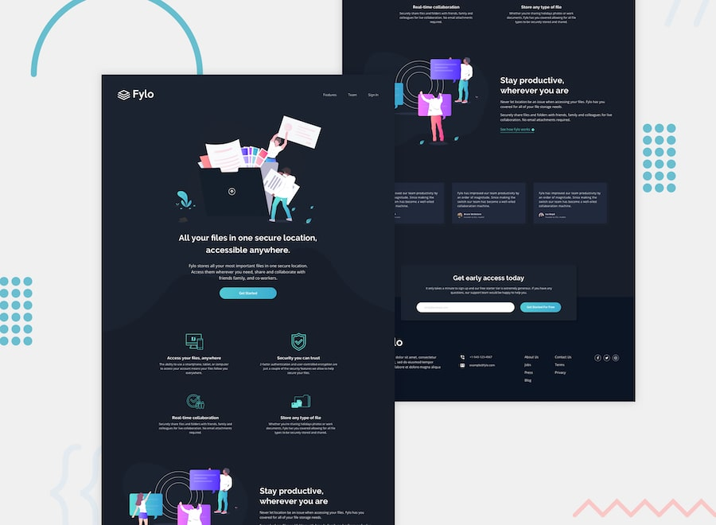
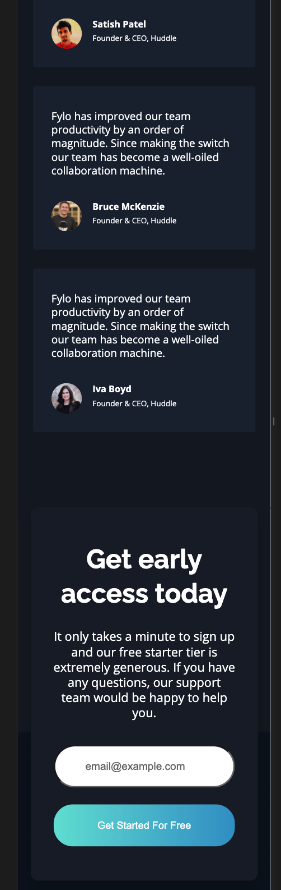

# Frontend Mentor - Fylo dark theme landing page

## The challenge

Your challenge is to build out this landing page and get it looking as close to the design as possible.

You can use any tools you like to help you complete the challenge. So if you've got something you'd like to practice, feel free to give it a go.

Your users should be able to: 

- View the optimal layout for the site depending on their device's screen size
- See hover states for all interactive elements on the page

Want some support on the challenge? [Join our Slack community](https://www.frontendmentor.io/slack) and ask questions in the **#help** channel.

### Links

- Solution URL: [Github](https://github.com/atulanand206/fem-fylo-dark)
- Live Site URL: [Netlify](https://fem-fylo-dark.netlify.app/)

### Screenshots

## My process

### Built with

- Semantic HTML5 markup
- CSS custom properties
- Flexbox
- CSS Grid
- Mobile-first workflow

### What I learned

### Continued development

## Author

- Atul Anand

## Acknowledgments

Thanks to [Kevin Powell](https://www.youtube.com/channel/UCJZv4d5rbIKd4QHMPkcABCw) for the focused YT tutorials.